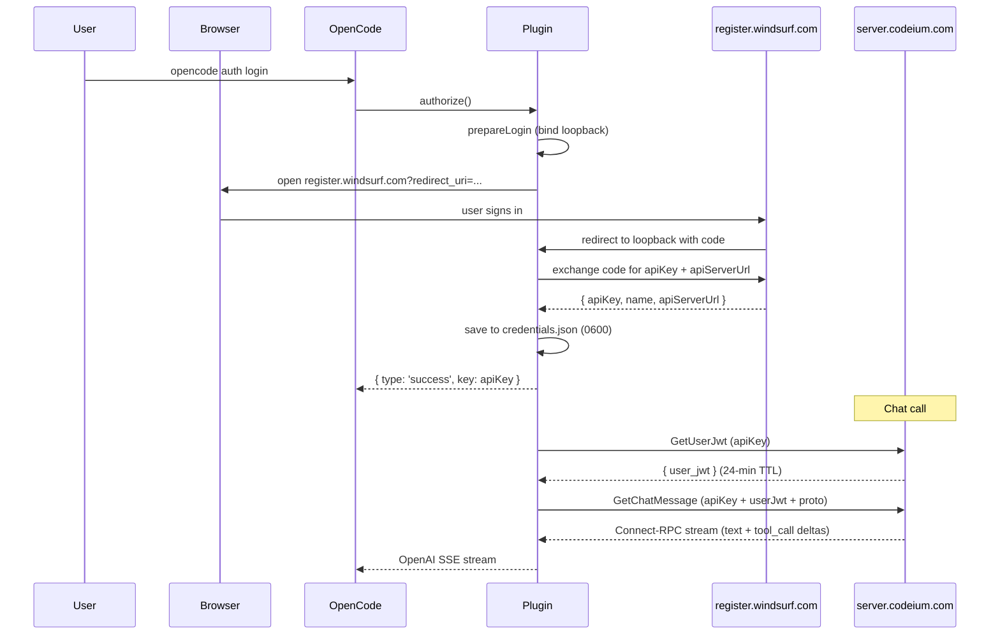

# AGENTS.md

Guidance for AI agents working with this repository.

## Overview

This is an **OpenCode plugin** that enables authentication with Windsurf/Codeium's cloud inference API. It provides access to 100+ models including `swe-1.6`, `claude-opus-4.7`, `gpt-5.5`, `kimi-k2.6`, and others available through Windsurf.

**Key insight**: The plugin is a **local proxy server** (at `127.0.0.1:42100`, Bearer-gated) that talks directly to `server.codeium.com` over HTTPS using Connect-RPC binary framing. No Windsurf desktop app is required, and no `language_server` child process is spawned. Authentication happens via a browser-based OAuth flow against `register.windsurf.com`, and credentials are persisted to `~/.config/opencode-windsurf-auth/credentials.json` (mode 0600).

The old pre-v0.3 architecture (local language_server spawning, Cascade gRPC flow, CSRF token scraping, `/proc`/`lsof` process discovery) has been entirely replaced. All legacy code paths are commented out in `credentials-resolver.ts` and kept only as reference.

## Build & Test

```bash
bun install      # Install dependencies
bun run build    # Compile TypeScript
bun run typecheck # Type checking only
bun test         # Run tests
```

## Module Structure

```
src/
├── plugin.ts                  # Main entry: local proxy server (port 42100),
│                              #   OAuth auth flow, SSE streaming
├── cli.ts                     # `opencode-windsurf-auth` CLI: login/logout/whoami/status
├── constants.ts               # Mostly dead code — only PLUGIN_ID is in use
├── debug-auth.ts              # Standalone debug script (dead code)
├── cloud-direct/              # Core inference path (ACTUAL architecture)
│   ├── index.ts               # Public surface exports
│   ├── chat.ts                # GetChatMessage streaming with idle timeouts,
│   │                          #   abort handling, event parsing
│   ├── auth.ts                # GetUserJwt mint/cache (24-min TTL, auto-refresh)
│   ├── wire.ts                # Manual protobuf + Connect-RPC framing (zero deps)
│   ├── metadata.ts            # Metadata builder for API requests
│   └── catalog.ts             # Per-account model catalog pre-flight
├── oauth/                     # Browser-based OAuth login flow
│   ├── login.ts               # Loopback callback + manual-paste strategies
│   ├── register-user.ts       # POST register.windsurf.com → {apiKey, name, apiServerUrl}
│   ├── storage.ts             # ~/.config/opencode-windsurf-auth/credentials.json
│   │                          #   (mode 0600, atomic writes with lockfile)
│   └── types.ts               # Region defaults, persisted-credentials shape
└── plugin/                    # Legacy/resolver layer (partially dead)
    ├── auth.ts                # Only WindsurfCredentials type + WindsurfError class
    │                          #   used (the rest is dead process-scraping code)
    ├── credentials-resolver.ts# Picks OAuth vs legacy (only cloud-direct path active)
    ├── models.ts              # Variant-aware model catalog (102+ models) +
    │                          #   MODEL_NAME_TO_ENUM fallback table
    ├── types.ts               # ModelEnum + ModelEnumValue type (proto enum values)
    ├── discovery.ts           # DEAD — extension.js field-number parsing
    └── protobuf.ts            # DEAD — varint/string helpers (superseded by
                               #   src/cloud-direct/wire.ts)
```

## Key Design Patterns

### 1. Local Proxy Server (Bearer-gated)

The plugin binds `127.0.0.1:42100` using either `Bun.serve` (preferred) or Node's `http.createServer` at plugin load time. Every request is authenticated via:

- **Bearergate**: `Authorization: Bearer <secret>` — the secret is a per-process 256-bit hex string minted once at module load. OpenCode's `chat.params` hook injects it as `options.apiKey` so the `@ai-sdk/openai-compatible` adapter sends it on every call.
- **Origin gate (HARD)**: any request carrying an `Origin` header that isn't a loopback origin (`127.0.0.1`, `localhost`, `[::1]`) gets a 403. OpenCode's server-side fetch omits `Origin` entirely, so only hostile browser tabs (DNS rebinding) are blocked.
- **Secret-agreement gate**: before forwarding to the cloud, the proxy validates that the Bearer matches either the in-process `PROXY_SECRET` or the persisted `api_key` from `credentials.json`. This ensures a local attacker without read access to the 0600-protected file can't forge requests.

The proxy exposes three endpoints:
| Path | Auth | Purpose |
|------|------|---------|
| `/health` | None | Returns `{ ok: true }` — no PID or version leak |
| `/v1/models` | Bearer | Lists available models with their variants (from the static catalog + per-account catalog) |
| `/v1/chat/completions` | Bearer | OpenAI-compatible chat completions (streaming and non-streaming) |

### 2. OAuth Login Flow

`opencode-windsurf-auth login` (or `opencode auth login` with the Windsurf provider) runs a browser-based OAuth flow:

1. Starts a loopback HTTP listener on a random port (`127.0.0.1:0`)
2. Opens the user's browser to `register.windsurf.com` with a `redirect_uri` pointing to the loopback listener
3. The OAuth callback captures the `code` and exchanges it for an `apiKey`, a user `name`, and a tenant-specific `apiServerUrl`
4. Credentials are written atomically to `~/.config/opencode-windsurf-auth/credentials.json` (mode 0600) with a lockfile to prevent cross-process races

The `register-user.ts` module calls `POST register.windsurf.com/api/register_user` which is an Auth0-authenticated RPC that returns the OAuth credentials.

### 3. Cloud-Direct HTTPS Inference (No Local `language_server`)

Every chat request is sent directly to `server.codeium.com/exa.api_server_pb.ApiServerService/GetChatMessage` over HTTPS using Connect-RPC binary framing:

```
POST https://server.codeium.com/exa.api_server_pb.ApiServerService/GetChatMessage
Content-Type: application/connect+proto
Connect-Protocol-Version: 1
Connect-Content-Encoding: gzip
Connect-Accept-Encoding: gzip

[5-byte Connect envelope] [gzip-compressed proto body]
```

The wire format (implemented in `src/cloud-direct/wire.ts`):
```
┌────────┬─────────────┬──────────────────────┐
│ 1 byte │   4 bytes   │       N bytes         │
│  flags │  length BE  │      payload          │
├────────┼─────────────┴──────────────────────┤
│ 0x01   │ = gzip-compressed                   │
│ 0x02   │ = end-of-stream (trailer frame)     │
└────────┴────────────────────────────────────┘
```

**Auth is a two-step handshake**:
1. **`GetUserJwt`** — called once per session (then cached ~24 min with 60s pre-expiry refresh). Returns a JWT with claims like `pro: true`, `teams_tier: TEAMS_TIER_DEVIN_PRO`, `exp` (epoch seconds).
2. **`GetChatMessage`** — every request includes BOTH the persistent `api_key` and the freshly-minted `user_jwt` in the `Metadata` proto field.

### 4. Manual Protobuf Encoding (Zero Dependencies)

All protobuf encoding is hand-rolled — no `protobuf.js` or similar library. The encoding helpers live in `src/cloud-direct/wire.ts`:

```typescript
function encodeVarint(value: number | bigint): Buffer { /* ... */ }
function encodeTag(fieldNum: number, wire: number): Buffer { /* ... */ }
function encodeString(fieldNum: number, s: string): Buffer { /* ... */ }
function encodeMessage(fieldNum: number, body: Buffer): Buffer { /* ... */ }
function frameConnectStream(body: Buffer, compress = true): Buffer { /* ... */ }
```

The `Metadata` message (`exa.codeium_common_pb.Metadata`) populates 13 fields the cloud expects: `ide_name`, `extension_version`, `api_key`, `locale`, `os`, `ide_version`, `request_id`, `session_id`, `extension_name`, `ls_timestamp`, `trigger_id`, `plan_name`, `ide_type`, and optionally `user_jwt`. Field numbers are hard-coded in `src/cloud-direct/metadata.ts` from captured LS upstream traffic (see `docs/CLOUD_DIRECT.md`).

### 5. Variant-Aware Model Resolution

Models are resolved through a two-layer system in `src/plugin/models.ts`:

1. **`VARIANT_CATALOG`** (102+ models) — each entry defines a canonical `id`, a `defaultUid` (the string sent as `chat_model_uid` in the proto), optional `variants` (e.g. `thinking`, `low`, `high`, `fast`), and optional `aliases`. Generated from live `GetCascadeModelConfigs` data.

2. **`MODEL_NAME_TO_ENUM`** (legacy fallback) — maps model name strings to proto enum values for older models that have no Cognition-era string UID.

`resolveModel(modelName, variantOverride?)` checks `VARIANT_CATALOG` first, then falls back to `MODEL_NAME_TO_ENUM`. It supports `:variant` (e.g. `claude-opus-4.7:high`) and hyphen-suffix variant forms (e.g. `claude-opus-4.7-high`).

### 6. Per-Account Model Catalog Pre-Flight

Before every chat request, `streamChatEvents` calls `getCachedCatalog` which fetches `GetCascadeModelConfigs` from the cloud (cached for 10 min). This returns the list of model UIDs enabled for the calling account, with a `disabled` flag. When the requested model is listed as disabled, the plugin throws a clear `ModelNotAvailableError` instead of relying on Cognition's opaque `"an internal error occurred"` error message.

Best-effort: if the catalog fetch fails (network, auth, schema drift), the plugin falls through to the chat call and lets the cloud surface its own error.

## Key Files

| File | Purpose |
|------|---------|
| `src/plugin.ts` | Main entry: local proxy server, OAuth auth flow, SSE streaming |
| `src/cloud-direct/chat.ts` | Streaming GetChatMessage with idle timeouts, abort, event parsing |
| `src/cloud-direct/wire.ts` | Manual protobuf + Connect-RPC framing (zero dependencies) |
| `src/plugin/models.ts` | Variant-aware model catalog (102+ models) + legacy enum fallback |
| `src/oauth/storage.ts` | Atomic credential I/O with lockfiles, mode 0600, symlink hardening |

## Architecture

### How It Works (Cloud-Direct)

```
 ┌─────────────┐     Bearer-gated      ┌──────────────────┐
 │  OpenCode    │── POST /v1/chat/ ───→│  Plugin Proxy    │
 │  (@ai-sdk)   │    completions        │  127.0.0.1:42100 │
 └─────────────┘    stream: true        └────────┬─────────┘
                                                  │ HTTPS POST
                                                  │ Connect-RPC binary
                                                  │ gzip-compressed proto
                                                  ▼
 ┌──────────────────────────────────────────────────┐
 │  server.codeium.com                               │
 │  /exa.api_server_pb.ApiServerService/             │
 │       GetChatMessage                              │
 │                                                   │
 │  Auth: apiKey (persistent) + userJwt (24-min TTL) │
 │  Body: Metadata + ChatMessagePrompts + Tools +    │
 │        CompletionConfig + cascadeId + modelUid    │
 └──────────────────────────────────────────────────┘
```

### Auth Flow



### Stream Events

`streamChatEvents` in `src/cloud-direct/chat.ts` yields typed events:

| Cloud Frame | Event | OpenAI SSE Mapping |
|---|---|---|
| Proto field #3 (delta_text) | `{ kind: 'text', text }` | `delta: { content }` |
| Proto field #9 (thinking) | `{ kind: 'reasoning', text }` | `delta: { reasoning }` |
| Proto field #6 ToolCallDelta (id+name) | `{ kind: 'tool_call_start', id, name }` | `delta: { tool_calls: [{ index, id, type: 'function', function: { name, arguments: '' } }] }` |
| Proto field #6 ToolCallDelta (args_delta) | `{ kind: 'tool_call_args', argsDelta }` | `delta: { tool_calls: [{ index, function: { arguments } }] }` |
| Proto field #5 (finish_reason) | `{ kind: 'finish', reason }` | Final chunk with `finish_reason` |
| Proto field #28 UsageStats | `{ kind: 'usage', promptTokens, completionTokens, ... }` | Usage chunk |

## Supported Models (100+)

The model catalog is auto-generated from Cognition's live `GetCascadeModelConfigs` response. The `VARIANT_CATALOG` in `src/plugin/models.ts` is the source of truth. Notable models and families include:

| Category | Examples |
|----------|----------|
| **Claude** | `claude-opus-4.5`, `claude-opus-4.6`, `claude-opus-4.7` (low/medium/high/xhigh/max variants, with/without fast/thinking), `claude-sonnet-4.5`, `claude-sonnet-4.6` |
| **GPT** | `gpt-5`, `gpt-5.1`, `gpt-5.2`, `gpt-5.4`, `gpt-5.5` (thinking-level variants), `gpt-5.1-codex`, `gpt-5.2-codex`, `gpt-5.3-codex`, `gpt-5.4-mini` |
| **Gemini** | `gemini-2.5-flash`, `gemini-2.5-pro`, `gemini-3.0-flash`, `gemini-3.1-pro`, `gemini-3.5-flash` |
| **SWE** | `swe-1.5` (base/fast), `swe-1.6` (base/fast) |
| **O-Series** | `o3`, `o3-mini`, `o3-pro`, `o4-mini` (thinking-level variants) |
| **DeepSeek** | `deepseek-v3`, `deepseek-v3-2`, `deepseek-r1`, `deepseek-r1-fast`, `deepseek-r1-slow`, `deepseek-v4` |
| **Other** | `llama-3.3-70b`, `llama-3.3-70b-r1`, `qwen-3-235b`, `qwen-3-coder-480b`, `grok-3`, `grok-3-mini`, `kimi-k2`, `kimi-k2.5`, `kimi-k2.6`, `glm-4.7`, `minimax-m2.5`, `gpt-oss-120b`, and 30+ enterprise/private model slots |

To discover available models at runtime: `curl http://127.0.0.1:42100/v1/models` (requires the plugin to be loaded).

## Current Status

### Implemented
- Local proxy server at `127.0.0.1:42100` with Bearer-gated auth (per-process random secret)
- OAuth via browser loopback → credentials saved to `~/.config/opencode-windsurf-auth/credentials.json`
- Cloud-direct HTTPS to `server.codeium.com` using Connect-RPC binary framing
- Manual protobuf encoding in `src/cloud-direct/wire.ts` (zero dependencies)
- Variant-aware model resolution (102+ models, `VARIANT_CATALOG` + `MODEL_NAME_TO_ENUM` fallback)
- Per-account model catalog pre-flight via `GetCascadeModelConfigs` (best-effort fallthrough)
- `GetUserJwt` caching (24-min TTL, refreshed ~60s before expiry)
- Streaming and non-streaming chat completions (OpenAI-compatible SSE)
- Tool calling: request encoding (proto field #10 `ChatToolDefinition`), response decoding (`tool_call_start`/`_args` events), and streaming to OpenCode as OpenAI SSE tool call deltas
- Multi-turn conversations with system-message collapsing (`collapseSystemIntoUser`)
- Reasoning / chain-of-thought streaming (proto field #9 → `delta.reasoning`)
- Usage token accounting (input/output/cached/cache-creation/reasoning tokens)
- Session/cascade-ID caching per (apiKey, host) for server-side prompt-cache hit rate
- Connect-RPC idle timeout (120s) + time-to-first-byte timeout (60s)
- Cross-version proxy sharing (per-process global slot with version suffix)
- Both `Bun.serve` and Node `http.createServer` runtimes
- CLI: `opencode-windsurf-auth login/logout/whoami/status`

### Environment Variables
| Variable | Purpose |
|----------|---------|
| `WINDSURF_PLUGIN_DEBUG=1` | File-based debug logging to `os.tmpdir() + '/opencode-windsurf-auth-debug/'` |
| `OPENCODE_WINDSURF_AUTH_MODE` | Now always `cloud-direct`; other values accepted for back-compat but aliased |

### Known Limitations
- **No image input** — the proto has an `images` field in `ChatMessagePrompt` (field #10), but it's not yet plumbed through from OpenCode's multimodal messages
- **No ExperimentConfig flags** — the 150+ row `ExperimentConfig` the IDE sends is omitted; the cloud uses defaults, which is fine for chat but may miss feature-flag-gated behaviors
- **macOS focused** — Linux/Windows `user_jwt` minting paths need broader validation (though `api_key`-based auth works cross-platform)

## Documentation

- [README.md](README.md) — Installation & usage
- [docs/CLOUD_DIRECT.md](docs/CLOUD_DIRECT.md) — **Read this if you're touching the wire format.** Full protocol research log: how cloud-direct was discovered via mitm reverse-proxy, the Connect-RPC envelope format, the `GetUserJwt` handshake, the 96 KB captured request body annotated with field numbers, streaming response parsing, tool-call delta encoding, the Devin WebSocket vs cloud-direct distinction, and tenant routing with `apiServerUrl`.
- [docs/OAUTH.md](docs/OAUTH.md) — **Read this if you're touching auth.** Browser OAuth flow details, Auth0 client IDs, redirect_uri modes, `RegisterUser` RPC, and region-specific configurations.
- [docs/WINDSURF_API_SPEC.md](docs/WINDSURF_API_SPEC.md) — Legacy API reference (wire format still accurate for some Connect-RPC methods; `RawGetChatMessage` flow described is dead — see `CLOUD_DIRECT.md` for the active path)
- [docs/CASCADE_PROTOCOL.md](docs/CASCADE_PROTOCOL.md) — Legacy reference for the old Cascade gRPC flow (`InitializeCascadePanelState`, `StartCascade`, etc.). No longer active — the cloud-direct path hits `GetChatMessage` directly.
- [docs/REVERSE_ENGINEERING.md](docs/REVERSE_ENGINEERING.md) — How the original local-language_server approach was discovered (historical reference only)
